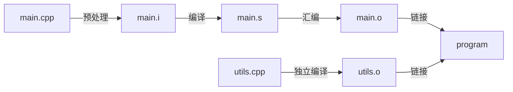

# Compiling

## TL;DR

- 绝大多数“编译/链接问题”都能归类为：**符号找不到**（undefined reference）、**符号重复**（duplicate symbol）、**ABI/编译选项不一致**（尤其是模板、inline、RTTI、异常、标准库实现）。
- 工程上排错优先级：先确认**编译命令** → 再看**符号表/依赖库** → 再定位到**哪个翻译单元**产生/缺失了符号。

## 相关链接

- `keywords.md`（宏/`inline`/`static`/转换会影响链接与 ODR）
- `template_stl.md`（模板实例化与链接期错误：undefined reference 的高频来源）
- `memory.md`（Before/After main、全局对象初始化/析构与工具链有关）

## 编译流程



1. 预处理 (Preprocessing)
   - 输入: `.cpp` 源文件

   - 输出: 预处理后的 `.i` 文件

   - 工具: 预处理器 (如 `g++ -E`)

   - 主要操作:
     - 展开 `#include` 头文件 (直接插入内容)
     - 处理 `#define` 宏替换
     - 条件编译 (`#ifdef`, `#endif`)
     - 删除注释

   - 示例:

```bash
g++ -E main.cpp -o main.i
```

1. 编译 (Compilation)
   - 输入: 预处理后的 `.i` 文件

   - 输出: 汇编代码 `.s` 文件

   - 工具: 编译器 (如 `g++ -S`)

   - 主要操作:
     - 语法/语义分析 (生成抽象语法树, AST)
     - 静态类型检查
     - 代码优化 (如常量折叠, 内联展开)
     - 生成平台相关的汇编代码

   - 示例:

```bash
g++ -S main.i -o main.s
```

1. 汇编 (Assembly)
   - 输入: 汇编代码 `.s` 文件

   - 输出: 目标文件 `.o` (二进制机器码)

   - 工具: 汇编器 (如 `as` 或 `g++ -c`）

   - 主要操作:
     - 将汇编指令转换为机器码
     - 生成符号表 (函数/变量地址的占位符)
     - 生成可重定位目标文件 (Relocatable Object File)

   - 示例:

```bash
g++ -c main.s -o main.o
```

1. 链接 (Linking)
   - 输入: 多个 `.o` 目标文件 + 静态库 (`.a`)

   - 输出: 可执行文件 (如 `a.out`)

   - 工具: 链接器 (如 `ld` 或 `g++`)

   - 主要操作:
     - 符号解析: 匹配函数/变量的声明与定义
     - 地址重定位: 将符号地址修正为最终内存地址
     - 合并目标文件: 生成可执行文件或动态库
     - 处理动态链接库 (`.so` 或 `.dll`）

   - 示例：

```bash
g++ main.o utils.o -o program
```

## Before `main`

- 设置栈指针
- 初始化静态 `static` 变量和 `global` 全局变量, 即 `.data` 段的内容
- 将未初始化部分的全局变量赋初值: (即 `.bss` 段的内容)
  - 数值型 `short`, `int`, `long` 等为 `0`
  - `bool` 为 `false`
  - 指针为 `nullptr` (本质是零初始化)
  - ...
- 全局对象初始化, 在 `main` 之前调用构造函数, 这是可能会执行前的一些代码
- 将 main 函数的参数 (`argc`，`argv` 等) 传递给 `main` 函数, 然后才真正运行 `main` 函数
- `__attribute__((constructor))`

## After `main`

- 全局对象的析构函数会在 `main` 函数之后执行
- 可以用 `atexit` 注册一个函数, 它会在 `main` 之后执行
- `__attribute__((destructor))`

## C++ 函数调用的压栈过程

```c++
#include <iostream>
using namespace std;

int f(int n) {
    cout << n << endl;
    return n;
}

void func(int param1, int param2) {
    int var1 = param1;
    int var2 = param2;
    // 注意：函数实参的求值顺序一般**不保证**（不同编译器/优化级别/ABI 可能不同）。
    // 因此这里 f(var1) 和 f(var2) 的打印顺序可能是 1,2 或 2,1。
    printf("var1 = %d, var2 = %d", f(var1), f(var2));
}

int main(int argc, char* argv[]) {
    func(1, 2);
    return 0;
}

// 输出结果:
// 2
// 1
// var1 = 1, var2 = 2
```

- 其中 `func` 中函数 `printf` 的“传参/入栈”过程与**调用约定**有关：
  - 在一些 x86 32-bit 调用约定中，可能体现为“从右到左压栈”
  - 在 x86-64 上大量参数会通过寄存器传递，未必体现为压栈
  - `func` 函数的运行状态
  - 参数准备（可能是寄存器/栈，顺序与 ABI 有关）
  - 返回地址
  - 被调用函数 (`callee`) 建立栈帧
  - `printf` 定义变量依次压栈
- 函数的调用过程:
  - 从栈空间分配存储空间
  - 从实参的存储空间复制值到形参栈空间
  - 进行运算
- 形参在函数未调用之前都是没有分配存储空间的, 在函数调用结束之后, 形参弹出栈空间, 清除形参空间
- 数组作为参数的函数调用方式是地址传递, 形参和实参都指向相同的内存空间, 调用完成后, 形参指针被销毁, 但是所指向的内存空间依然存在, 不能也不会被销毁
- 当函数有多个返回值的时候, 不能用普通的 `return` 的方式实现, 需要通过传回地址的形式进行, 即地址/指针传递

## 方法调用的原理 (栈，汇编)

- 机器用栈来传递过程参数, 存储返回信息, 保存寄存器用于以后恢复, 以及本地存储.
- 为单个过程分配的那部分栈称为帧栈; 帧栈可以认为是程序栈的一段, 它有两个端点:
  - 一个标识起始地址, 一个标识着结束地址
  - 两个指针结束地址指针 `esp`, 开始地址指针 `ebp`
- 由一系列栈帧构成, 这些栈帧对应一个过程, 而且每一个栈指针 + 4 的位置存储*函数返回地址*, 每一个栈帧都建立在调用者的下方, 当被调用者执行完毕时, 这一段栈帧会被释放
  - 由于栈帧是向地址递减的方向延伸, 因此如果我们将栈指针减去一定的值, 就相当于给栈帧分配了一定空间的内存
  - 如果将栈指针加上一定的值, 也就是向上移动, 那么就相当于压缩了栈帧的长度, 也就是说内存被释放了
- 过程实现:
  1. 备份原来的帧指针, 调整当前的栈帧指针到栈指针位置
  2. 建立起来的栈帧就是为被调用者准备的, 当被调用者使用栈帧时, 需要给临时变量分配预留内存
  3. 使用建立好的栈帧, 比如读取和写入, 一般使用 `mov`, `push` 以及 `pop` 指令等等
  4. 恢复被调用者寄存器当中的值, 这一过程其实是从栈帧中将备份的值再恢复到寄存器, 不过此时这些值可能已经不在栈顶了
  5. 释放被调用者的栈帧, 释放就意味着将栈指针加大, 而具体的做法一般是直接将栈指针指向帧指针, 因此会采用类似下面的汇编代码处理
  6. 恢复调用者的栈帧, 恢复其实就是调整栈帧两端, 使得当前栈帧的区域又回到了原始的位置
  7. 弹出返回地址, 跳出当前过程, 继续执行调用者的代码
- 过程调用和返回指令
  - `call` 指令
  - `leave` 指令
  - `ret` 指令

## 定义和声明的区别

- 如果是指变量的声明和定义:
  - 从编译原理上来说, 声明是仅仅告诉编译器, 有个某类型的变量会被使用, 但是编译器并不会为它分配任何内存
  - 而定义就是分配了内存

- 如果是指函数的声明和定义:
  - 声明: 一般在头文件里; 对编译器说: 这里我有一个函数叫 `function()` 让编译器知道这个函数的存在
  - 定义: 一般在源文件里; 具体就是函数的实现过程写明函数体

## 常见链接错误与排查

### `undefined reference` / `Undefined symbols`

- 典型原因：
  - 只有声明没有定义（忘了把 `.cpp` 编进来）
  - 静态库链接顺序问题（尤其是类 Unix 工具链上）
  - 模板定义放在 `.cpp` 导致某些翻译单元看不到（见 `template_stl.md`）
  - C/C++ 混编未加 `extern "C"` 造成名称修饰（name mangling）不匹配
  - 编译选项不一致导致 ABI 不匹配（例如 RTTI/异常开关、标准库版本等）

- 工程抓手（macOS / Linux 通用思路）：
  - 看最终编译/链接命令：`clang++ -### ...` 或 `g++ -v ...`
  - 查看目标文件/库里到底有没有这个符号：
    - macOS：`nm -gU -C your.o` / `nm -gU -C libxxx.a`
    - Linux：`nm -gC your.o` / `nm -gC libxxx.a`
  - 看可执行文件依赖了哪些动态库：
    - macOS：`otool -L a.out`
    - Linux：`ldd a.out`

### `duplicate symbol` / multiple definition

- 典型原因：
  - 头文件里放了“非 inline 的定义”（全局变量、非 inline 函数、非 `static`/匿名命名空间对象）
  - 违反 ODR（一个实体在多个翻译单元有不同定义）
  - 链接进来了两份同名目标文件/库

- 工程抓手：
  - 定位重复符号来自哪两个对象：链接器报错通常会给出对象文件名；必要时用 `nm` 搜索同名符号。
  - 头文件里的“定义”通常应改为：
    - 函数：`inline` 或只放声明，定义放到 `.cpp`
    - 变量：C++17 起可用 `inline` 变量；否则用 `extern` 声明 + 单一定义

## 工程抓手：把“调用约定/压栈顺序”说清前提

- x86-32 时代常见“从右到左压栈”属于**特定 ABI/调用约定**下的现象。
- 在 x86-64（SysV / Windows x64）上，参数大量通过寄存器传递，“压栈顺序”不再是理解函数调用的主要抓手。
