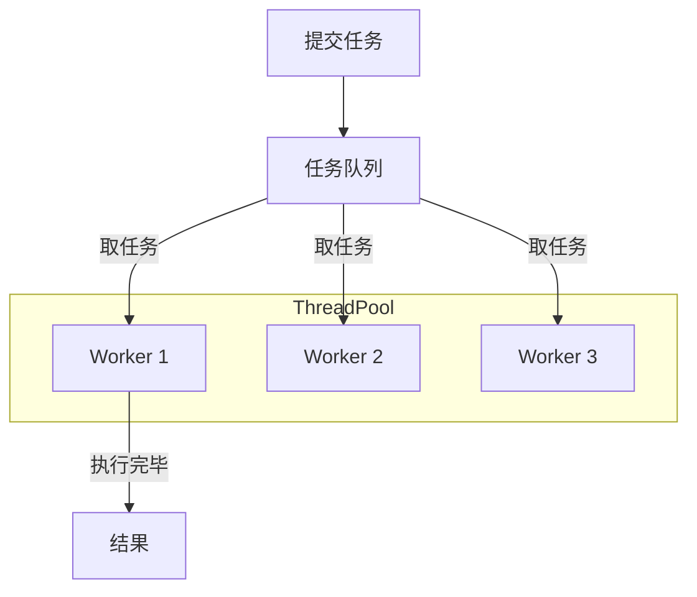

# Concurrency

这一篇聚焦“并发工程”本身：线程同步原语、内存一致性模型、常见并发 bug、以及 Linux 上的同步实现细节（如 futex/锁/屏障等）。  
进程/线程基础、调度算法、IPC 请看 [`process.md`](process.md)。

## 1. 线程同步机制 (Synchronization Primitives)

在多线程环境下，为保证数据一致性，需要使用同步机制。

#### 1. 互斥锁 (Mutex)

- 保证临界区**独占访问**。
- **自旋锁 (Spinlock)**: 忙等待 (Loop)，不让出 CPU。适合持有时间极短的场景。

#### 2. 条件变量 (Condition Variable)

- 用于线程间的**等待**与**通知** (Wait/Notify)。
- **典型场景**: 生产者-消费者模型。
- **注意**: 必须配合 Mutex 使用，防止丢失唤醒信号（Lost Wakeup）。

#### 3. 信号量 (Semaphore)

- **计数器**，控制并发访问资源的**数量**。
- **场景**: 连接池、限流。

#### 4. 读写锁 (Read-Write Lock)

- **场景**: 读多写少。
- **规则**: 读读并行，读写互斥，写写互斥。

## 2. 高级并发话题 (Advanced Concurrency)

### 线程池 (Thread Pool)

复用线程，控制并发度，减少创建销毁开销。



**核心参数**:

1. **Core Pool Size**: 核心线程数 (常驻)。
2. **Max Pool Size**: 最大线程数 (爆发时临时扩容)。
3. **Queue Capacity**: 任务队列容量。
4. **Reject Policy**: 拒绝策略 (抛异常、丢弃、调用者执行)。

**C++ 简易实现参考**:

```cpp
class ThreadPool {
public:
    ThreadPool(size_t n) {
        for (size_t i = 0; i < n; ++i) {
            workers.emplace_back([this]() {
                while (true) {
                    std::function<void()> task;
                    {
                        std::unique_lock<std::mutex> lock(queue_mutex);
                        condition.wait(lock, [this]() { return stop || !tasks.empty(); });
                        if (stop && tasks.empty()) return;
                        task = std::move(tasks.front());
                        tasks.pop();
                    }
                    task();
                }
            });
        }
    }
    // ... enqueue 实现省略 (使用 packaged_task 和 future) ...
private:
    std::vector<std::thread> workers;
    std::queue<std::function<void()>> tasks;
    std::mutex queue_mutex;
    std::condition_variable condition;
    bool stop = false;
};
```

### 性能优化

1. **无锁编程 (Lock-free)**
   - 使用 **CAS (Compare-And-Swap)** 原子指令，避免锁竞争导致的上下文切换。
   - **ABA 问题**: 值从 A 变 B 又变回 A，CAS 检查通过但实际已发生变化。需加**版本号**解决。
2. **伪共享 (False Sharing)**
   - 多线程修改同一 Cache Line (通常 64 字节) 的不同变量，导致缓存频繁失效。
   - **解决**: 缓存行填充 (**Padding**) 或 C++ `alignas(64)`.

3. **线程数计算公式**
   - **CPU 密集型**: $N_{cpu} + 1$ (多 1 个用于容错/缺页中断)。
   - **I/O 密集型**: $N_{cpu} \times (1 + \frac{WaitTime}{ComputeTime})$。

## 3. 内存一致性模型 (Memory Consistency Models)

理解多线程在多核 CPU 上的可见性问题，是无锁编程、原子操作与“为什么需要栅栏/屏障”的基础。

### 为什么需要一致性模型？

现代 CPU 为了性能，会进行 **指令重排 (Instruction Reordering)**、使用 **写缓冲 (Store Buffer)**、以及多级缓存。结果是：一个核心上的写入对其他核心“何时可见”并不总是直观的代码顺序。

### 常见模型（直观理解）

1. **顺序一致性 (Sequential Consistency, SC)**
   - 最直观：所有线程看到的执行顺序与程序顺序一致。
   - 成本高；现实系统通常只在“显式同步”点上逼近 SC 语义。

2. **完全存储定序 (Total Store Order, TSO)**
   - 常见于 x86/AMD64 的“较强”模型直觉。
   - 典型点：可能出现 **Store → Load** 的可见性延迟（写被缓冲，其他核心晚一点看到）。

3. **弱/松散一致性 (Weak/Relaxed)**
   - 常见于 ARM/Power 等架构。
   - 允许更广泛的重排；必须依赖**内存屏障/原子语义**来建立顺序与可见性。

### Happens-before（建议补的“统一语言”）

你可以用 **happens-before** 作为跨语言/跨平台统一描述：

- 如果 A happens-before B，那么 A 的写入对 B 可见，且 A 的操作顺序先于 B。
- 建立 happens-before 的常见方式：锁的释放/获取、线程 join、原子操作的 acquire/release、条件变量的通知配合互斥等。

### 内存屏障 (Memory Barrier / Fence)

- **LoadFence**: 限制读的重排与可见性顺序。
- **StoreFence**: 限制写的重排与对外可见顺序。
- **FullFence**: 同时限制读写重排（最强，开销通常也更大）。

（提示）真正写无锁结构时更常用“原子操作的内存序”而不是裸 fence：如 C++ `memory_order_acquire/release/seq_cst`。

## 4. 线程实现模型 (Threading Models)

用户态线程/协程与内核线程的映射关系，决定了“能不能利用多核”“阻塞是否拖垮整个进程”“切换成本”等关键性质。

### 1) 多对一 (N:1) —— 用户级线程

- 多个用户线程映射到一个内核线程。
- **优点**: 切换快（用户态完成），实现简单。
- **缺点**: 不能利用多核并行；一个线程阻塞（如同步 I/O）会阻塞整个进程。

### 2) 一对一 (1:1) —— 内核级线程

- 一个用户线程对应一个内核线程（Linux `pthread` 常见直觉）。
- **优点**: 真并行；一个线程阻塞不影响其他线程。
- **缺点**: 创建/销毁与切换成本更高；线程数受资源限制。

### 3) 多对多 (M:N) —— 混合模型

- M 个用户线程映射到 N 个内核线程，由运行时调度。
- **优点**: 兼顾“轻量级大量并发”和“利用多核并行”。
- **缺点**: 运行时实现复杂，调试更难。
- **例子**: Go 的 goroutine + 调度器（可以作为这里的扩展阅读点）。

## 5. 常见并发 Bug (Concurrency Bugs)

除了死锁，还需要覆盖“看起来没卡住但就是不对/不快”的典型问题。

1. **竞态条件 (Race Condition)**
   - 程序结果依赖不可控的时序，常见于“先检查再执行 (check-then-act)”之间被并发修改。
   - **解决**: 互斥/原子/正确的 happens-before；配合工具（如 TSAN）做检测。

2. **活锁 (Livelock)**
   - 线程没有阻塞，但在不断重试/让步，整体无法推进。
   - **解决**: 引入退避（随机退避/指数退避）、减少对称性、限制重试次数。

3. **饥饿 (Starvation)**
   - 某些线程长期得不到资源（锁/CPU/IO），进度极慢。
   - **解决**: 公平锁/队列锁、优先级老化、缩短临界区、避免持锁做 I/O。

4. **优先级反转 (Priority Inversion)**（建议补充）
   - 低优先级线程持有锁，高优先级线程阻塞等待，中优先级线程不断抢占导致高优先级线程“反而更慢”。
   - **解决**: 优先级继承 (Priority Inheritance)、避免跨优先级共享锁。

### 5.5 死锁 (Deadlock)

死锁是指两个或两个以上的执行流在执行过程中，因争夺资源而造成的一种互相等待的现象。若无外力作用，它们都将无法推进下去。

#### 死锁产生的四个必要条件

只有当以下四个条件同时满足时，才会发生死锁：

1. **互斥条件 (Mutual Exclusion)**:
   - 资源是独占的，同一时刻只能由一个执行流使用。
2. **请求与保持条件 (Hold and Wait)**:
   - 已保持至少一个资源，但又提出新的资源请求，而该资源已被其他执行流占有。
3. **不剥夺条件 (No Preemption)**:
   - 已获得的资源在未使用完之前，不能被其他执行流强行剥夺，只能由自己释放。
4. **循环等待条件 (Circular Wait)**:
   - 存在一种“资源请求的环”：A 等 B、B 等 C、…、最后又等回 A。

#### 死锁处理策略

- **预防死锁 (Prevention)**：破坏四个必要条件中的一个即可
  - **破坏互斥**：允许资源共享（如只读文件）。通常不可行，因为许多资源必须互斥
  - **破坏请求与保持**：一次性申请所有资源（吞吐差、资源利用率低）
  - **破坏不剥夺**：申请新资源失败时，释放已占有的资源
  - **破坏循环等待**：资源有序分配（给资源编号，只能按编号递增顺序申请）
- **避免死锁 (Avoidance)**：在分配前避免进入不安全状态
  - **银行家算法 (Banker’s Algorithm)**：分配前判断是否仍存在安全序列；否则拒绝分配
- **检测与解除 (Detection & Recovery)**：允许发生，但由系统检测并解除
  - **检测**：资源分配图；若图中存在环（且每种资源只有一个实例）则死锁
  - **解除**：资源剥夺 / 撤销进程（按优先级、运行时间等策略）/ 进程回退到检查点

（提示）本仓库不再单独保留 `deadlock.md`，死锁内容统一维护在本小节。

## 6. 其他同步机制 (Advanced Primitives)

### RCU (Read-Copy-Update)

- **核心思想**: 读几乎无锁（或极轻），写通过“拷贝-修改-替换指针”，旧版本在宽限期 (grace period) 后释放。
- **优势**: 读路径极快，特别适合读多写少且允许读到旧数据的场景。
- **典型场景**: 内核数据结构、路由表/配置表等“读远多于写”的共享结构。

### 屏障 (Barrier)

- 用于多线程分阶段计算：所有线程到达某一阶段点后，才能进入下一阶段。
- **典型场景**: 并行迭代算法、分块矩阵计算、多阶段 pipeline。

## 7. Linux 并发与同步实现 (Linux Concurrency Internals)

这一节聚焦“同步原语在 Linux 上的实现直觉”，调度器/CFS/上下文切换观测等内容已移动到 [`process.md`](process.md)。

### 7.1 Futex：用户态快路径 + 内核态慢路径

`futex`（fast userspace mutex）是 Linux 下许多同步原语（如 pthread mutex/cond）的关键基础。

#### 设计目标

- **无竞争**时尽量不进内核：只在用户态用原子指令完成加锁/解锁（快路径）。
- **有竞争**时才进内核：把竞争者睡眠并由内核负责唤醒（慢路径）。

#### 典型流程（直觉版）

- 加锁：
  - 尝试 CAS 抢锁成功 → 返回（不陷入内核）。
  - 失败（竞争）→ `futex_wait` 把自己挂起，等待被唤醒。
- 解锁：
  - 原子释放锁；若发现有等待者 → `futex_wake` 唤醒一个或多个。

#### 重要变体

- **PI futex (Priority Inheritance)**: 支持优先级继承，用于缓解优先级反转（常见于 RT 场景）。

### 7.2 用户态互斥锁的常见实现策略（pthread mutex 直觉）

- **先自旋、再睡眠**：短竞争时自旋更快；竞争严重或持锁时间长则进入 `futex_wait` 睡眠更省 CPU。
- **自适应互斥 (adaptive)**（实现/平台相关）：在判断持锁者正在运行时短暂自旋，否则直接睡眠。

### 7.3 内核里的“睡眠锁”与“自旋锁”（概念对比）

- **Mutex / Semaphore（睡眠锁）**：
  - 竞争时可睡眠（会触发调度），适合持锁时间可能较长的路径。
  - 不能在原子上下文/中断上下文里使用（因为不能睡眠）。
- **Spinlock（自旋锁）**：
  - 竞争时忙等，不触发调度，适合极短临界区或必须在原子上下文使用的场景。
  - 自旋太久会浪费 CPU，并放大尾延迟。

### 7.4 内存屏障：编译器屏障 vs CPU 屏障（系统视角）

- **编译器屏障**：禁止编译器重排（不一定限制 CPU 重排）。
- **CPU 屏障（smp_mb/rmb/wmb 的直觉）**：限制跨核可见性与硬件层面的重排。
- 在内核/无锁结构中，“看起来正确”的代码可能因为缺少屏障而在弱一致性架构上出错。

## 相关阅读

- [`process.md`](process.md)：进程/线程基础、调度算法、IPC
- 死锁：已并入本文“常见并发 Bug → 死锁”
