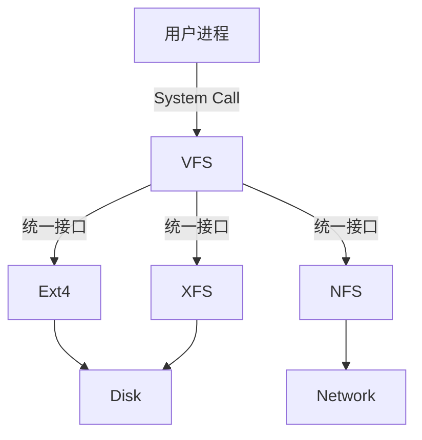

# File System

## VFS (Virtual File System)

VFS 是 Linux 内核中的一个软件层，用于给用户空间程序提供文件系统接口，同时提供内核中的一个抽象层以支持不同类型的文件系统。

- **统一接口**: `open()`, `read()`, `write()` 等系统调用通过 VFS 转发给具体的文件系统实现（如 ext4, xfs, nfs）。
- **四大对象**:
  1. **Superblock**: 描述整个文件系统的信息（如块大小、总块数）。
  2. **Inode (索引节点)**: 描述文件的元数据（权限、大小、时间、数据块位置）。
  3. **Dentry (目录项)**: 描述文件名与 Inode 的对应关系，构成目录树。
  4. **File**: 进程打开的文件对象，记录偏移量等动态信息。

## 关键概念

### Inode (索引节点)

- **内容**: 文件权限 (mode)、所有者 (uid, gid)、大小 (size)、时间戳 (ctime, mtime, atime)、数据块指针。
- **特点**: 文件名不存储在 Inode 中，而是存储在目录的 Dentry 中。
- **唯一性**: 在一个文件系统中，Inode 号唯一标识一个文件。

### File Descriptor (文件描述符)

- 进程级别的概念。
- 每个进程维护一个打开文件表，FD 是表的索引（整数）。
- 0: stdin, 1: stdout, 2: stderr。

## 链接 (Links)

| 特性           | 硬链接 (Hard Link)             | 软链接/符号链接 (Symbolic Link)    |
| :------------- | :----------------------------- | :--------------------------------- |
| **原理**       | 多个 Dentry 指向同一个 Inode   | 独立的 Inode，内容是目标文件的路径 |
| **Inode**      | 与源文件相同                   | 拥有独立的 Inode                   |
| **跨文件系统** | 不支持                         | 支持                               |
| **针对目录**   | 通常不支持 (防止环路)          | 支持                               |
| **源文件删除** | 链接仍有效 (Inode 引用计数 -1) | 链接失效 (Dangling link)           |
| **命令**       | `ln source target`             | `ln -s source target`              |

## 存储/块设备相关（已移动）

`磁盘调度/RAID/IOPS` 更贴近 I/O/存储主题，已移动到 [`io.md`](io.md)。
