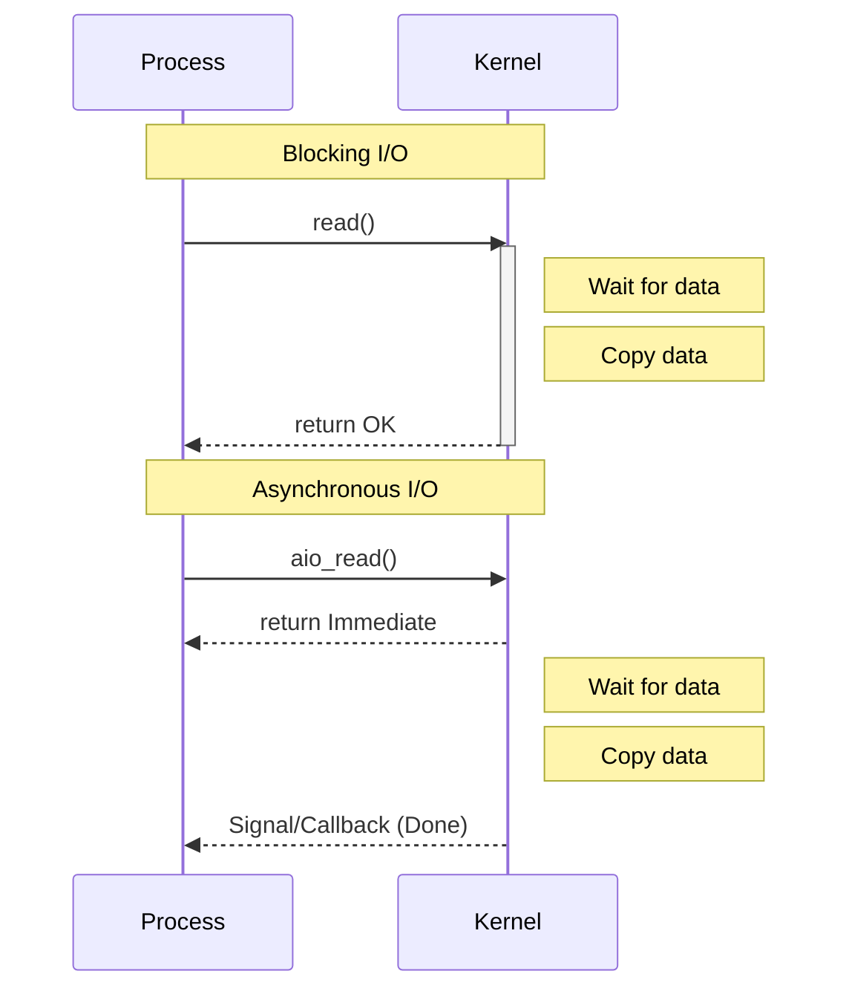

# I/O Management

## 五种 I/O 模型

Unix 网络编程中定义了 5 种 I/O 模型。一个 I/O 操作通常分为两个阶段：

1. **等待数据准备好** (Waiting for the data to be ready) - 如网卡接收到数据。
2. **将数据从内核拷贝到用户空间** (Copying the data from the kernel to the process)。

### 1. 阻塞 I/O (Blocking I/O)

- 默认模式。
- 进程发起系统调用后，被挂起，直到数据准备好且拷贝完成才返回。
- 简单，但效率低。

### 2. 非阻塞 I/O (Non-blocking I/O)

- 设置 socket 为 `O_NONBLOCK`。
- 进程发起调用，若数据未就绪，内核立即返回 `EWOULDBLOCK` 错误。
- 进程需要通过**轮询 (Polling)** 不断检查。
- 浪费 CPU 资源。

### 3. I/O 多路复用 (I/O Multiplexing)

- 使用 `select`, `poll`, `epoll` 监控多个 FD。
- 进程阻塞在 `select` 上，而不是具体的 I/O 调用上。
- 当有 FD 就绪时，返回，进程再发起 read 操作。
- **优势**: 单个线程处理多个连接 (Reactor 模式)。

| 特性           | select               | poll          | epoll                                 |
| :------------- | :------------------- | :------------ | :------------------------------------ |
| **底层实现**   | 数组 (bitmap)        | 链表          | 红黑树 + 就绪链表                     |
| **最大连接数** | 1024 (通常)          | 无限制        | 无限制                                |
| **IO 效率**    | 线性轮询 O(N)        | 线性轮询 O(N) | 事件驱动 O(1)                         |
| **拷贝开销**   | 每次调用拷贝 FD 集合 | 每次调用拷贝  | `mmap` 共享 (部分实现) / 仅注册时拷贝 |

### Epoll 触发模式

Epoll 支持两种触发模式：**水平触发 (LT)** 和 **边缘触发 (ET)**。

#### 1. 水平触发 (LT - Level Triggered)

- **默认模式**。
- 只要 FD 还有数据可读，每次 `epoll_wait` 都会返回该 FD。
- **优点**: 编程简单，不易丢失数据。
- **缺点**: 如果不一次性读完，会频繁触发通知，效率略低。

#### 2. 边缘触发 (ET - Edge Triggered)

- 高速模式。
- 只有 FD 状态**发生变化**时（如从无数据变有数据），才触发一次通知。
- **注意**: 必须配合**非阻塞 I/O (Non-blocking I/O)**，并且在一次通知中**循环读取**直到返回 `EAGAIN`，否则可能丢失后续数据。
- **优点**: 减少了系统调用次数，效率更高。

### 4. 信号驱动 I/O (Signal-driven I/O)

- 建立 SIGIO 信号处理函数。
- 内核数据就绪时发送信号通知进程。
- 进程在信号处理函数中调用 read。

### 5. 异步 I/O (Asynchronous I/O, AIO)

- 进程发起 aio_read，立即返回。
- 内核在**数据准备好**且**拷贝到用户空间**后，通知进程。
- **区别**: 其他 4 种都是**同步 I/O**，因为第二阶段（拷贝数据）都会阻塞进程。只有 AIO 是真正的异步。

## 零拷贝 (Zero Copy)

传统 I/O (`read` + `write`) 需要 4 次上下文切换和 4 次数据拷贝。零拷贝旨在减少拷贝次数和 CPU 上下文切换。

### 传统流程

Disk -> Kernel Buffer -> User Buffer -> Kernel Socket Buffer -> Network

### 常见零拷贝技术

1. **mmap + write**
   - `mmap` 将内核缓冲区映射到用户空间。
   - 减少一次 CPU 拷贝 (Kernel -> User)。
   - 仍需 4 次上下文切换，3 次拷贝 (Disk->Kern, Kern->Socket, Socket->Net)。

2. **sendfile**
   - `ssize_t sendfile(int out_fd, int in_fd, off_t *offset, size_t count);`
   - 直接在内核空间传输数据 (Disk Buffer -> Socket Buffer)。
   - 2 次上下文切换，2 次拷贝 (Disk->Kern, Kern->Socket) + DMA。
   - 若网卡支持 SG-DMA，可实现真正的“零 CPU 拷贝”。

3. **splice**
   - 两个文件描述符之间移动数据，不经过用户空间。
   - 必须有一端是管道。

## 存储 I/O：磁盘调度 / RAID / IOPS

这部分更偏“块设备/存储性能”，与文件系统抽象（VFS/inode）区分开会更清晰：

- 文件系统抽象看 [`filesystem.md`](filesystem.md)
- 系统负载/观测指标看 [`payload.md`](payload.md)

### 磁盘调度算法（概念）

- **FCFS**：先来先服务
- **SSTF**：最短寻道时间优先
- **SCAN**：电梯算法，磁头来回扫描
- **C-SCAN**：循环扫描，磁头单向移动

### RAID (Redundant Array of Independent Disks)

- **RAID 0**：条带化 (Striping)，无冗余，性能最高，数据易丢失
- **RAID 1**：镜像 (Mirroring)，冗余高，读性能好，写性能受限，利用率约 50%
- **RAID 5**：分布式奇偶校验，允许坏 1 块盘，利用率约 \((N-1)/N\)
- **RAID 10**：先镜像再条带化（RAID 1 + RAID 0），兼顾速度和冗余

### IOPS

- **IOPS (Input/Output Operations Per Second)**：每秒 I/O 次数，随机读写性能常用指标
- HDD IOPS 通常较低（~100-200），SSD 更高（万级/十万级，视介质与队列深度而定）
