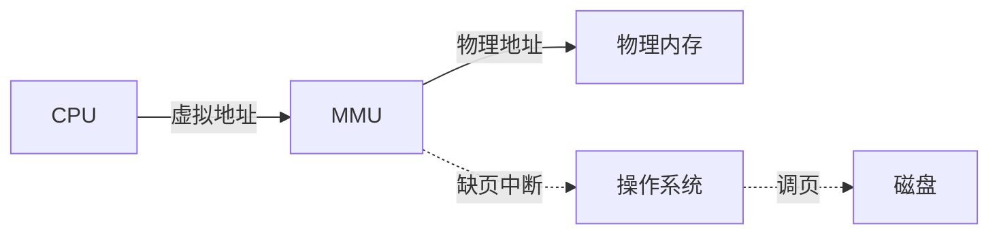
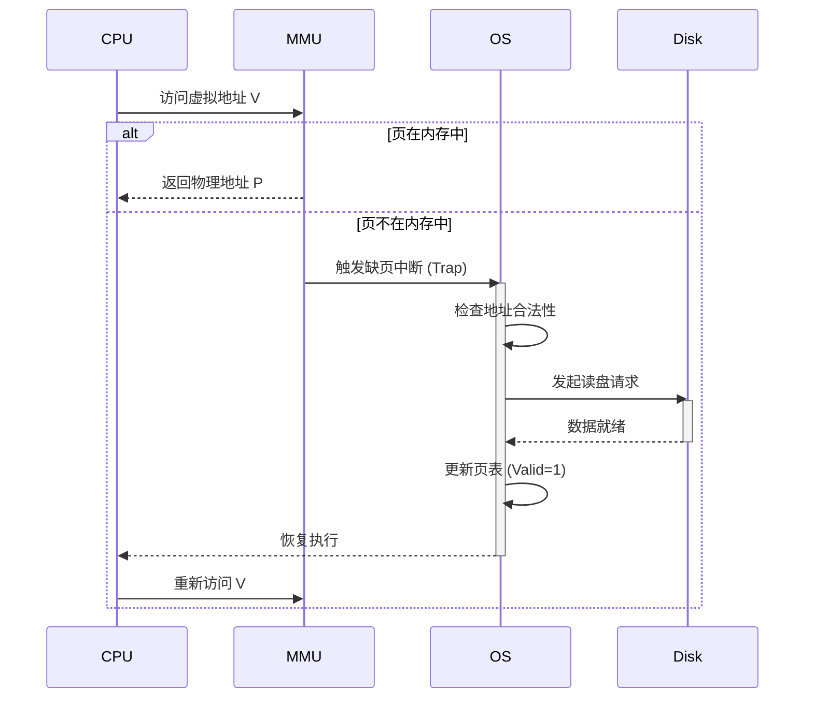

# Memory Management

## 虚拟内存 (Virtual Memory)

虚拟内存是计算机系统内存管理的一种技术。它使得应用程序认为它拥有连续的可用的内存（一个连续完整的地址空间），而实际上，它通常是被分隔成多个物理内存碎片，还有部分暂时存储在外部磁盘存储器上，在需要时进行数据交换。

### 逻辑地址 vs 物理地址

- **逻辑地址 (Logical Address)**: 程序中使用的地址，也称为虚拟地址。
- **物理地址 (Physical Address)**: 加载到内存地址寄存器中的地址，内存单元的真正地址。

### MMU (Memory Management Unit)

MMU 是硬件设备，负责将虚拟地址映射为物理地址。

- **基本原理**: CPU 发出虚拟地址 -> MMU 查表 -> 物理地址 -> 访问内存。

## 分页与分段 (Paging & Segmentation)

### 分页 (Paging)

- 将物理内存分为固定大小的块，称为**页框 (Page Frame)**。
- 将逻辑内存也分为同样大小的块，称为**页 (Page)**。
- **页表 (Page Table)**: 记录逻辑页号到物理页框号的映射关系。
- **TLB (Translation Lookaside Buffer)**: 快表，是 MMU 中的一块高速缓存，存储最近使用的页表项，加速地址转换。

### 分段 (Segmentation)

- 将用户程序地址空间分为若干个大小不等的段，每段定义了一组逻辑信息（如代码段、数据段、堆栈段）。
- **段表**: 记录段号、段基址、段界限。

### 段页式管理

先分段，再在段内分页。结合了分段便于共享/保护和分页内存利用率高的优点。

## 页面置换算法 (Page Replacement Algorithms)

当内存不足时，操作系统需要选择一个页面换出到磁盘。

1. **FIFO (First In First Out)**:
   - 淘汰最先进入内存的页面。
   - 缺点: 可能出现 Belady 异常（分配的物理块数增加，缺页率反而提高）。

2. **OPT (Optimal)**:
   - 最佳置换算法。淘汰以后永不使用或最长时间内不再被访问的页面。
   - 缺点: 无法实现，只能作为衡量标准。

3. **LRU (Least Recently Used)**:
   - 最近最久未使用。淘汰最近一段时间内最久没有被访问的页面。
   - 实现: 链表或栈，开销较大。

4. **LFU (Least Frequently Used)**:
   - 最少使用。淘汰最近一段时间内访问次数最少的页面。

5. **Clock (时钟置换算法)**:
   - 也称 NRU (Not Recently Used)。
   - 给每个页面设置访问位。指针循环扫描，访问位为 1 则置 0 并跳过，为 0 则淘汰。

## 缺页中断 (Page Fault)

当 CPU 访问的虚拟页面不在物理内存中时，MMU 发出**缺页中断**，请求操作系统将该页调入内存。

### 处理流程

1. **地址检查**: 检查 CPU 请求的虚拟地址是否合法（是否在 VMA 中）。
2. **缺页判断**: 若合法但页表项 Valid 位为 0，触发缺页中断，陷入内核态。
3. **磁盘读取**: 内核根据页表找到磁盘上的位置，将该页读入物理内存（若内存已满，需先执行页面置换算法）。
4. **修改页表**: 更新页表项，将 Valid 位置 1，建立物理映射。
5. **恢复执行**: 返回用户态，重新执行刚才那条指令。

## Linux 内存管理

### 伙伴系统 (Buddy System)

- 用于管理**物理内存页框**。
- 解决**外部碎片**问题。
- 将内存按 2 的幂次划分（1页, 2页, 4页...）。
- 分配时，如果需要 2 页，且只有 4 页块，则将 4 页裂变为两个 2 页，一个分配，一个留空。
- 回收时，如果相邻的伙伴块都空闲，则合并。

### Slab 分配器

- 基于伙伴系统之上，用于管理**内核小对象**（如 `task_struct`, `inode`）。
- 解决**内部碎片**问题。
- 使用对象缓存池（Cache），快速分配和回收固定大小的对象。
