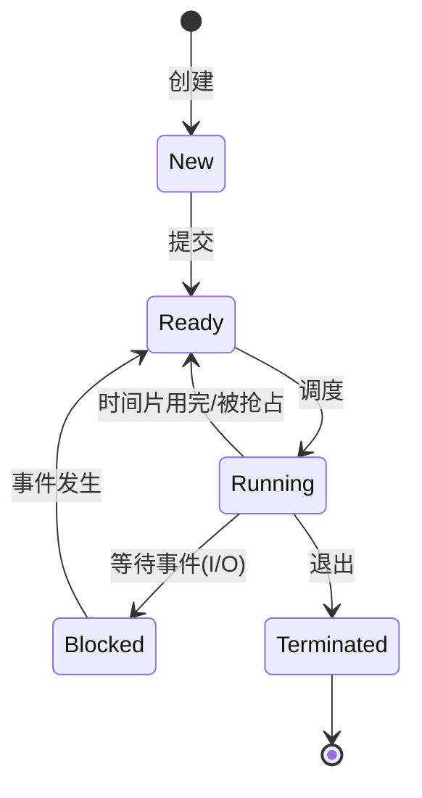

# Process (进程)

这一篇聚焦“进程作为 OS 抽象”的基础：状态模型、`fork/exec`、调度算法、IPC 等；并补充线程/协程的对比位置。  
并发原语（锁/条件变量/信号量/内存模型/RCU/futex 等）请看 [`concurrency.md`](concurrency.md)。

## 1. 进程基础 (Process Basics)

### 进程状态模型

进程通常有 5 种基本状态：创建、就绪、运行、阻塞、终止。

### 特殊进程类型

1. **僵尸进程 (Zombie Process)**: 子进程结束，父进程未 wait，占用 PID。
2. **孤儿进程 (Orphan Process)**: 父进程先结束，被 init 收养，无害。
3. **守护进程 (Daemon Process)**: 后台服务进程，不关联终端。

### 核心系统调用

- `fork()`: 复制进程 (COW 技术)。
- `vfork()`: 共享地址空间，阻塞父进程 (旧技术)。
- `clone()`: `pthread_create` 的底层，可精细控制共享资源。
- `exec()` 族: 替换当前进程代码段/数据段。

## 2. 线程与协程 (Thread & Coroutine)

### 进程 vs 线程 vs 协程

| 特性       | 进程 (Process)                        | 线程 (Thread)                              | 协程 (Coroutine)                   |
| :--------- | :------------------------------------ | :----------------------------------------- | :--------------------------------- |
| **定义**   | 资源分配的基本单位                    | 调度/执行的基本单位                        | 用户态轻量级线程                   |
| **开销**   | **大** (独立内存空间, 切换需刷新 TLB) | **中** (共享进程内存, 切换仅保存寄存器/栈) | **小** (用户态切换, 无内核陷入)    |
| **内存**   | 独立的虚拟地址空间                    | 共享进程地址空间, 独占栈                   | 共享进程地址空间, 独占栈(堆上分配) |
| **通信**   | IPC (管道, 消息队列, 共享内存)        | 直接读写全局变量/堆内存                    | 通道 (Channel), 共享内存           |
| **健壮性** | **高** (一进程挂掉不影响其他)         | **低** (一线程崩溃可能导致进程崩溃)        | **高** (异常可被捕获处理)          |
| **并发**   | 多进程并发                            | 多线程并发                                 | 单线程内分时复用 (非并行)          |

## 3. 调度算法 (Scheduling)

### 3.1 经典算法

#### FCFS (先来先服务)

- **非抢占**。
- **优点**: 简单，公平。
- **缺点**: 对短作业不友好 (护航效应)。

#### SJF (短作业优先)

- **非抢占**。
- **优点**: 平均等待时间最短。
- **缺点**: 长作业可能饿死; 难以准确预估运行时间。

#### RR (时间片轮转)

- **抢占式** (时间片用完)。
- **优点**: 响应时间短，适合分时系统。
- **缺点**: 时间片太小会导致频繁切换开销；太大则退化为 FCFS。

#### 优先级调度

- 可抢占或不可抢占。
- **缺点**: 低优先级进程可能**饥饿** (Starvation)。
- **解决**: **老化** (Aging) 技术，随时间推移增加等待进程的优先级。

#### 多级反馈队列 (MLFQ)

- **结合了 RR 和优先级**。
- 设置多个队列，优先级逐级降低，时间片逐级增加。
- 新进程进入最高优先级队列。若时间片用完未结束，降级到下一级队列。
- **优势**: 既能快速响应短作业，又能照顾长作业。

## 4. 进程间通信 (IPC)

| 方式                | 效率   | 场景           | 备注                                      |
| :------------------ | :----- | :------------- | :---------------------------------------- |
| **管道 (Pipe)**     | 低     | 父子进程简单流 | 半双工，缓冲区有限                        |
| **有名管道 (FIFO)** | 低     | 无亲缘进程流   | 文件系统节点可见                          |
| **消息队列**        | 中     | 频繁交换小数据 | 独立于进程，需内核拷贝                    |
| **共享内存**        | **高** | 大数据交换     | **零拷贝**，直接读写内存，需配信号量/互斥 |
| **Socket**          | 中     | 跨网络/本机    | 通用性最强，开销稍大                      |
| **信号 (Signal)**   | /      | 事件通知       | 唯一的异步通信 (如 `SIGKILL`)             |

## 5. 系统调用 / 陷入内核 (Syscall & Trap)

用户态程序想要执行“需要特权”的操作（访问设备、创建进程、操作页表、读写文件等），必须通过 **系统调用** 进入内核，让内核代为完成，并由内核做权限与参数校验。

### 5.1 为什么需要陷入（用户态 vs 内核态）

- **隔离与安全**：用户态不能直接碰硬件/关键内存；否则任意进程都能破坏系统。
- **统一抽象**：文件/进程/网络等抽象由内核集中管理，通过 syscall 暴露稳定接口（ABI）。

### 5.2 一次系统调用大致发生了什么（直觉版）

（不同架构细节不同，这里是通用直觉）

1. 用户态准备参数（寄存器/栈），并执行进入内核的指令（如 x86 的 `syscall`，或旧的 `int 0x80`）。
2. CPU 切换到更高特权级，跳到内核入口代码；内核在当前 CPU 的**内核栈**上建立现场（保存返回地址/标志寄存器/必要通用寄存器等）。
3. 内核分发到对应的 syscall 处理函数：校验参数、访问内核对象、可能阻塞（等待 I/O、等待锁、缺页等）。
4. 返回用户态：恢复现场，把返回值放入约定位置（通常是寄存器），继续执行用户态下一条指令。

### 5.3 “陷入”与“中断”的区别（先留个钩子）

- **系统调用**通常被视为一种“受控的异常/陷入”（同步发生、由当前指令触发）。
- **硬件中断**通常是异步发生（与当前指令流无关），用于通知外设事件（网卡收包、定时器 tick 等）。

## 6. 异常 vs 中断 (Exception vs Interrupt)

这两个概念经常混用，建议用两个维度区分：

### 6.1 同步 vs 异步

- **异常（同步）**：由“正在执行的指令/指令流”引起。
  - 例：除零、页故障（缺页）、非法指令、系统调用（trap）。
- **中断（异步）**：由外部事件引起，与当前执行到哪条指令无关。
  - 例：定时器中断、网卡中断、磁盘完成中断。

### 6.2 可恢复 vs 不可恢复（对工程更有用）

- **可恢复**：处理完还能回到原来指令继续执行（典型：缺页异常；syscall 返回）。
- **不可恢复**：通常导致进程被信号终止或崩溃（典型：非法地址访问导致的 `SIGSEGV`）。

（关联阅读）缺页异常的详细流程在 [`memory.md`](memory.md) 里。

## 7. 上下文切换：到底保存/恢复了什么？(Context Switch)

先区分两个概念：

- **CPU 现场（register context）**：一条执行流在 CPU 上运行所需的寄存器/栈等。
- **进程/线程上下文（task context）**：一次“切走再切回”所需的全部状态（包含但不限于寄存器）。

### 7.1 两类常见切换

#### 线程切换（同一进程内，地址空间不变）

- **一定会保存/恢复**：
  - 通用寄存器（PC/IP、SP、callee-saved 等按 ABI 约定）
  - 部分控制寄存器/标志位（如 flags）
  - 内核栈/当前 task 指针（内核需要知道“我现在在谁的上下文里”）
- **可能会额外保存/恢复（按实现/配置）**：
  - 浮点/向量寄存器（FPU/SSE/AVX）通常采用“惰性保存/按需保存”策略
  - 调试寄存器、性能计数等

#### 进程切换（不同进程，地址空间变化）

除了线程切换的内容，还会涉及：

- **地址空间相关**：
  - 切换页表基址（不同体系结构叫法不同；直觉是“换一套映射”）
  - TLB 可能被部分/全部失效（或用 ASID/PCID 等机制减少 flush）
- **资源视图变化**：
  - 不同进程的文件表/信号处理等（多数是“指针/引用”层面变化，由内核在 task_struct/pcb 中持有）

### 7.2 触发上下文切换的典型原因

- **自愿切换（voluntary）**：线程主动睡眠/阻塞（等待 I/O、等待锁/条件变量、`sleep` 等）。
- **非自愿切换（involuntary）**：时间片用完、被更高优先级任务抢占、频繁中断导致调度等。

### 7.3 一次切换的“开销到底在哪”

- **保存/恢复寄存器**：纯 CPU 指令开销。
- **缓存/TLB 破坏**：切换后工作集不在 cache，尤其跨核迁移更明显。
- **地址空间切换**：更容易造成 TLB miss；进程切换通常比同进程线程切换更贵。

（关联阅读）

- 线程同步/锁竞争如何放大切换与调度成本：[`concurrency.md`](concurrency.md)
- 阻塞 I/O/多路复用如何影响“睡眠/唤醒”路径：[`io.md`](io.md)

## 8. Linux 调度实现与观测（补充）

这一节把“经典调度算法”落到 Linux 实现直觉上：你在生产环境里看到的吞吐/延迟波动，经常来自调度器、抢占、上下文切换与 CPU 亲和性/迁移等因素。

### 8.1 Linux 任务抽象：`task_struct` 与 `clone()`

- 在 Linux 内核里，进程与线程都用 `task_struct` 表示（更准确叫“任务 task”）。
- `clone()` 通过不同 flag 决定共享哪些资源（地址空间、文件描述符表、信号处理、命名空间等），从而形成“线程”或“进程”的语义差异。
- **关键点**：“创建线程”不仅是用户态对象，它会对应一个内核 task（典型 1:1 模型直觉）。

### 8.2 CFS 调度器 (Completely Fair Scheduler)

#### 核心思想

- CFS 试图让每个 runnable task 获得“公平”的 CPU 时间。
- 使用 **虚拟运行时间 `vruntime`** 表示“已经占用 CPU 的公平份额”，`vruntime` 越小越优先运行。

#### 数据结构与选择逻辑

- 每 CPU 维护一个 runqueue（概念上），CFS 用 **红黑树**维护 runnable task（按 `vruntime` 排序）。
- 每次挑选 `vruntime` 最小的 task 运行；运行一段时间后更新其 `vruntime`，再放回树中。

#### 优先级/权重（nice 的直觉）

- nice 越小（优先级越高）权重越大：同样的真实运行时间会“增长更慢”的 `vruntime`，因此获得更多 CPU 份额。

#### 你在工程里会看到的现象

- **短任务延迟**：频繁唤醒/睡眠的任务可能触发唤醒抢占（wakeup preemption），影响 tail latency。
- **多核负载均衡**：task 可能被迁移到其他 CPU（cache/TLB 冷启动），吞吐会上下波动。
- **cgroup/容器**：CPU 限额/配额会改变可用算力，“看起来没满载但就是慢”很常见。

### 8.3 抢占与上下文切换开销 (Preemption & Context Switch)

#### 两类切换

- **自愿切换 (Voluntary)**：task 主动睡眠/阻塞（等待锁、等待 I/O 等）。
- **非自愿切换 (Involuntary)**：时间片用完、优先级更高任务唤醒、IRQ/softirq 导致的抢占等。

#### 上下文切换的“贵”在哪里

- **寄存器/栈切换**：保存/恢复通用寄存器、切换内核栈指针等。
- **地址空间切换**：不同进程切换可能需要切换页表基址，导致 **TLB 刷新/失效**。
- **缓存局部性破坏**：CPU cache 冷启动，尤其是跨核迁移时更明显。
- **NUMA**：线程跑到远端节点访问内存，会显著增加访问延迟。

（经验法则）临界区里做 I/O、持锁时间长、线程数远大于核心数，都会放大调度与切换成本。

### 8.4 常用观测点（把系统现象落到证据上）

- **/proc**：
  - `/proc/<pid>/status`：线程数、上下文切换计数（`voluntary_ctxt_switches` / `nonvoluntary_ctxt_switches`）
  - `/proc/interrupts`：中断分布与热点
- **perf**：
  - `perf sched`：调度延迟、唤醒到运行的时间
  - `perf top/record`：热点与锁竞争（配合符号）
- **ftrace/tracefs**（更深入时）：跟踪调度事件、锁事件

## 相关阅读

- [`concurrency.md`](concurrency.md)：线程同步原语、内存一致性模型、futex/RCU 等更偏“并发工程/系统实现”的内容
- [`memory.md`](memory.md)：缺页异常与虚拟内存
- [`io.md`](io.md)：阻塞/非阻塞与 I/O 多路复用
